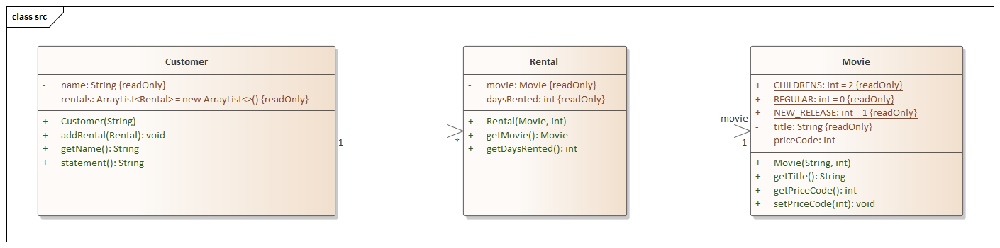

# Refactoring 
 Teaching Refactoring with Martin Fowler
 
 ## The video store example
 
 Das Beispielprogramm ist einfach und nutzlos. Videotheken gibt es nicht mehr und
 Verwaltungsprogramme dafür also obsolet. Dennoch möchten wir dieses klassische Beispiel
 aus dem Buch *Refactoring* von Martin Fowler, das im Jahr 2000 erschienen ist hernehmen, 
 um die Grundideen zu veranschaulichen.
 
 Das Programm soll Rechnungen für Kunden einer Videothek erstellen und ausdrucken.
 Das Programm ermittelt hierzu welche Filme der Kunde wie lange ausgeliehen hat. 
 Es berechnet daraus die Leihgebühr. Dabei gibt es drei Arten von Filmen: Normale 
 Filme (REGULAR), Kinderfilme (CHILDREN) und Neuerscheinungen (NEW_RELEASE).
  
 Weiterhin zeigt das Programm Bonuspunkte (FrequentRenterPoints) an.
 
 Die Elemente der Videothek werden durch Klassen repräsentiert.
 
  
 
 `Movie`  ist nur eine einfache Datenklasse.
 
 `Rental` repräsentiert eine Ausleihe eines Films durch einen Kunden.
 
 `Customer` repräsentiert einen Kunden der Videothek. Diese Klasse hat neben den
 Zugriffsmethoden auch eine Methode statement(), die eine Rechnung ausgibt.
 
 
 
 
 
  